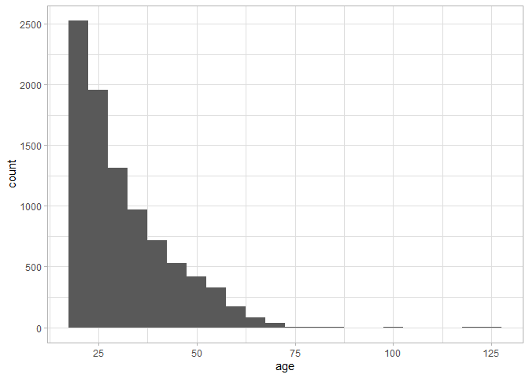

Example Analysis
================
Hansjörg Plieninger
26 Juni, 2019

``` r
devtools::load_all(".")
```

    #> Loading researchCompendium

    #> Loading required package: ggplot2

``` r
data(jackson)
```

## R Markdown

This is an R Markdown document. Markdown is a simple formatting syntax
for authoring HTML, PDF, and MS Word documents. For more details on
using R Markdown see <http://rmarkdown.rstudio.com>.

When you click the **Knit** button a document will be generated that
includes both content as well as the output of any embedded R code
chunks within the document. You can embed an R code chunk like this:

``` r
jackson[, 1:5]
```

    #> # A tibble: 9,051 x 5
    #>       q0    q1    q2    q3    q4
    #>    <dbl> <dbl> <dbl> <dbl> <dbl>
    #>  1     5     5     5     5     1
    #>  2     4     4     4     4     4
    #>  3     1     1     3     3     2
    #>  4     4     4     5     2     5
    #>  5     5     1     3     4     5
    #>  6     1     5     4     4     3
    #>  7     2     1     4     1     3
    #>  8     3     5     4     3     4
    #>  9     1     5     4     2     3
    #> 10     3     5     5     1     5
    #> # ... with 9,041 more rows

``` r
# The pipe %>% can be used because it is reexported, see file 'R/utils-pipe.R'.
# ggplot2 can be used because the package lists it under Depends in file 'DESCRIPTION'.
jackson %>% 
    ggplot(aes(x = age)) +
    geom_histogram(binwidth = 5) +
    theme_light()
```



``` r
# Function add_numbers can be used because it is defined in 'R/add_numbers.R'.
add_numbers(42, pi)
```

    #> [1] 45.14159
